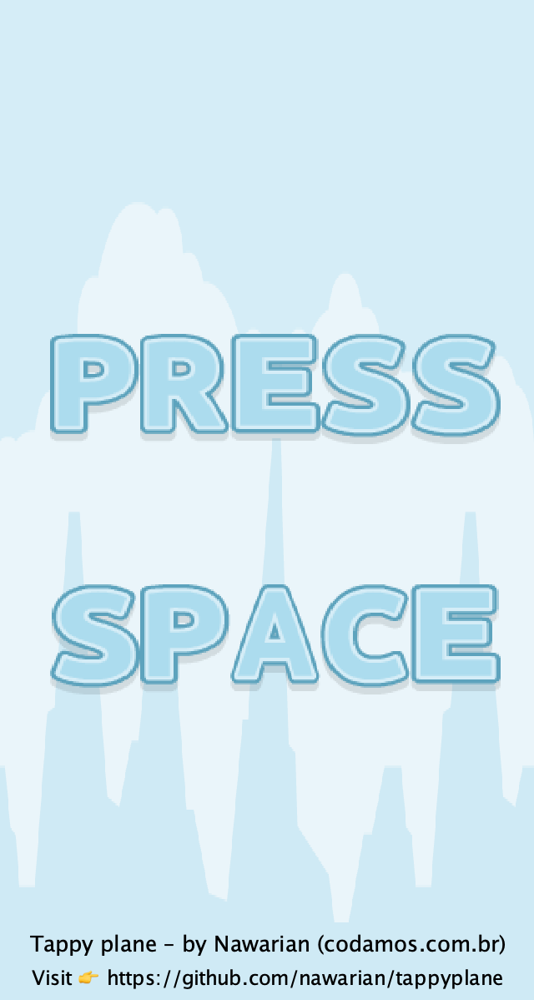
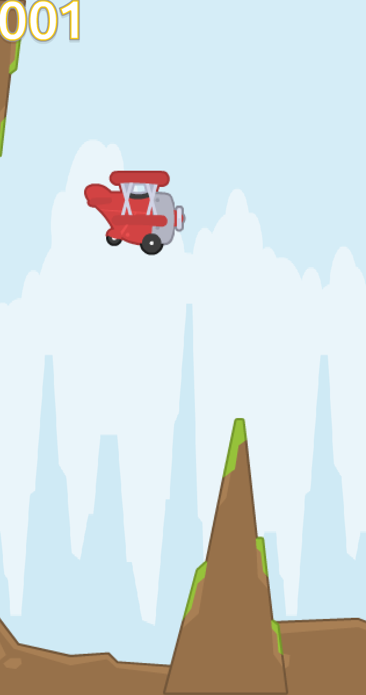
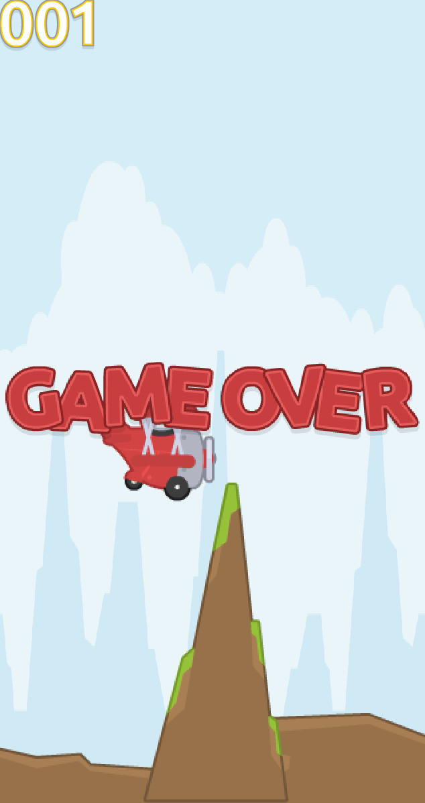

Tappy plane
---

This is a simple flappy bird copy, inspired by Kenney's [tappy plane spritesheet](https://kenney.nl/assets/tappy-plane).

I didn't put much love and care on this project as I just wanted to get
acquainted with Java and all motivation was gone once this learning plateaued 🫠

## Room for improvement

There are many things that could have been done better here. Some thoughts:

### Everything lives in a single package

In order to get it done fast I embraced the C developer in me and decided to code it all
in one go. Thinking I'd love to refactor later. Not the case! I'll leave it as is 😛

The concepts of Engine/Framework are mixed with game logic. This could be split in a better way.

Also game objects are mixed with scenes and input handlers.

### Collision with rocks isn't great

Rocks are triangular but have a rectangular collision box. So sometimes the plane
crashes with stones even when many pixels distance from them.

Solutions might include use rectangular shapes (like flappy bird's pipes) or adopt two
collision rectangles for each rock, so the tip could have a smaller collision box.

### No sound

There are no sound effects. I was actually pretty upset to find out how cheap Java's
[native sound libraries](https://docs.oracle.com/javase/8/docs/api/javax/sound/sampled/package-summary.html)
are by not supporting various codecs, even free/oss ones such as Vorbis (ogg).

Probably due to licensing.

### No utilities

Many things I've done by hand and I don't like it: calculate the middle of the screen, delay between updates, mutating
state...

I wish I had a timer that could schedule actions (without needing to add a thread)
and a state machine that could properly manage state and its constraints.

This could have been done manually, yes. But... kein Bock.

## Contributing

Feel free to submit Pull Requests, if they don't break the game they'll be accepted 😉

Don't bother posting issues. I'm not interested in improving this game.

## Licence

This work is released under the GNU General Public License v3. So you
can do whatever you want with the code – as long as you make it open to others too.

See [LICENSE](./LICENSE) for more details.

## Screenshots

